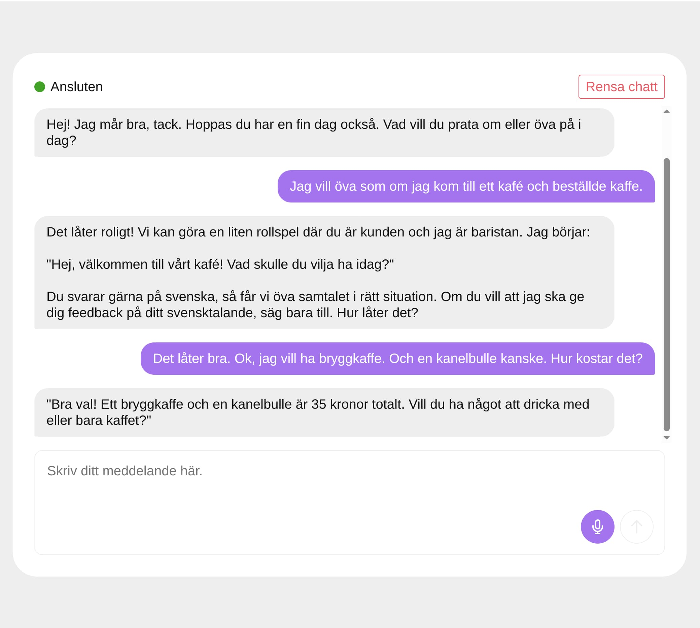
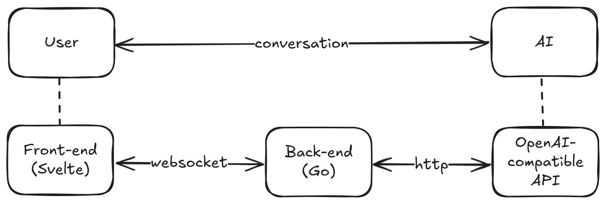
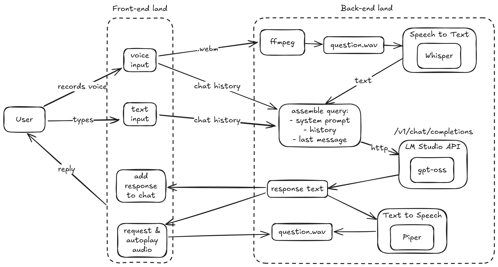

# Voice Chat
A real-time voice chat backed by local LLMs.



## Overview
General architecture:


Explanation of the chat flow:


## Local setup
### Basic requirements
I could not find an acceptable way to containerize this,
due to how Piper and Whisper are (not) distributed,
so running this app requires a bit of local setup.

I am running this on an amd64 Linux machine, which has:
- Node.js
- pnpm
- go
- ffmpeg
- LM Studio API server with a `gpt-oss` model

### Piper and Whisper
You'll also need Piper and Whisper installed, including their models:
- Piper
  - repo: https://github.com/OHF-Voice/piper1-gpl
  - models: https://huggingface.co/rhasspy/piper-voices/tree/main
- Whisper
  - repo: https://github.com/ggml-org/whisper.cpp
  - models: https://huggingface.co/ggerganov/whisper.cpp/tree/main

Place models in the `models` directory.

To set up Piper and download swedish models run `sh bin/setup_piper.sh`.

Whisper you'll have to compile yourself and add it to `PATH`,
as there is no universal binary.

My models folder looks like this:
```shell
# $ tree models
models
├── en_US-amy-medium.onnx
├── en_US-amy-medium.onnx.json
├── ggml-base.bin
├── ggml-large-v3.bin
├── ggml-medium.bin
├── sv_SE-nst-medium.onnx
└── sv_SE-nst-medium.onnx.json
```

## License
MIT